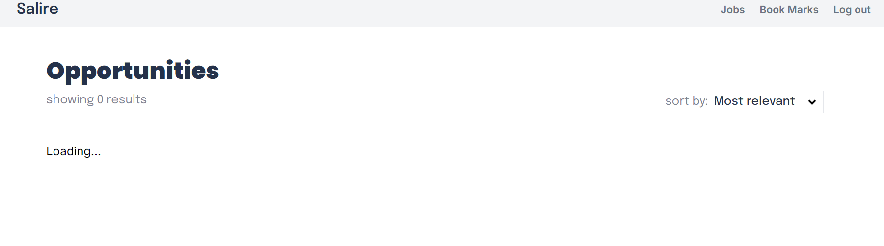
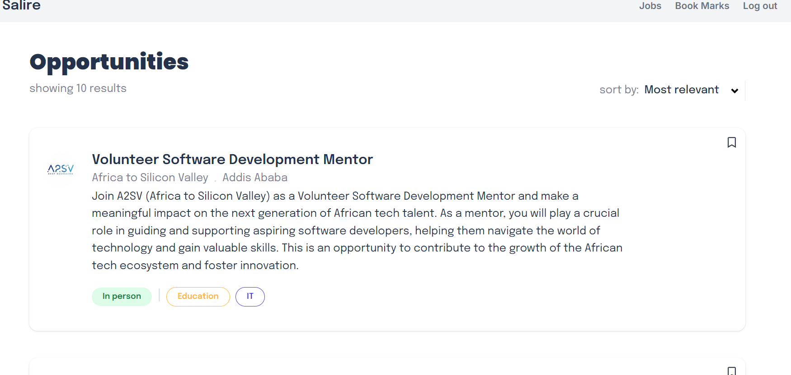
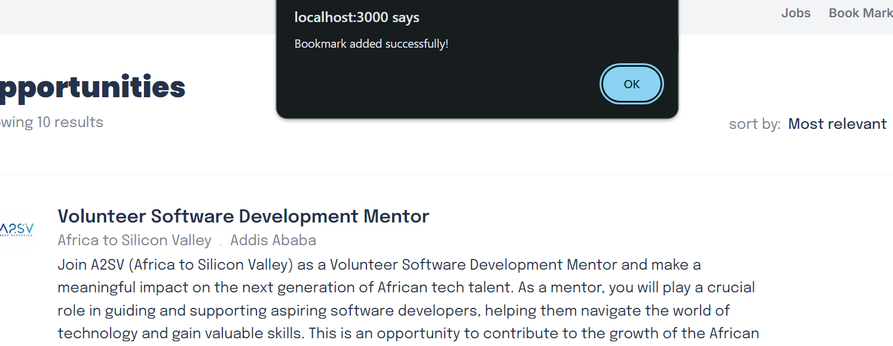
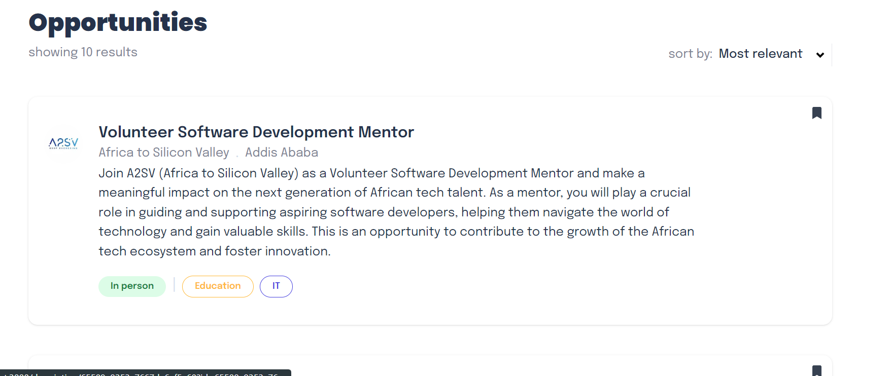
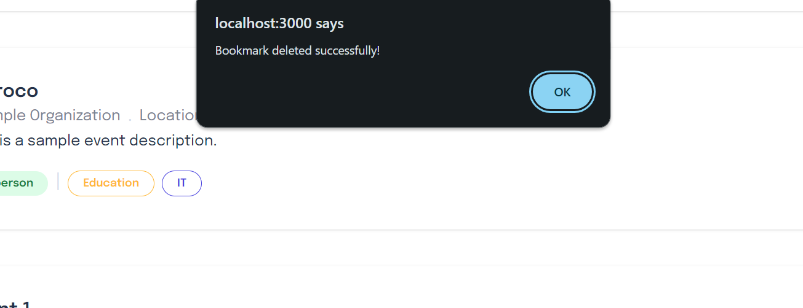
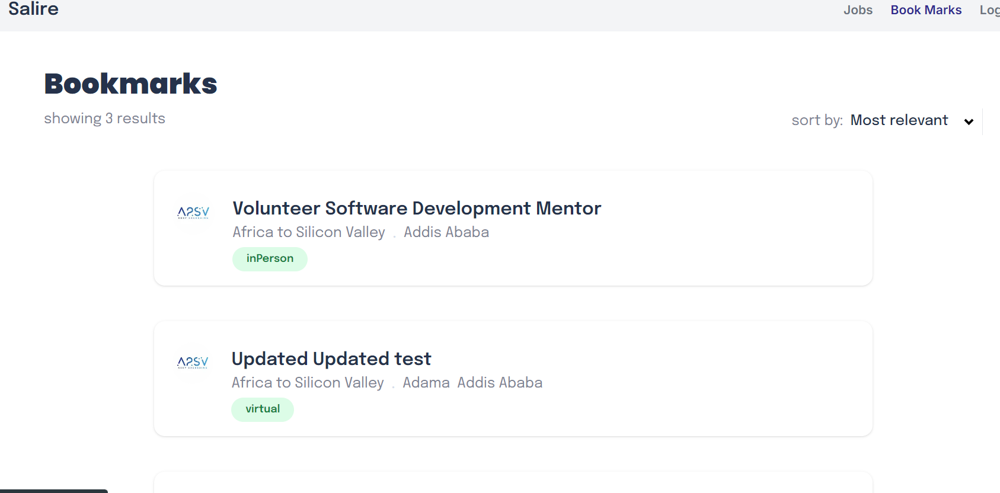
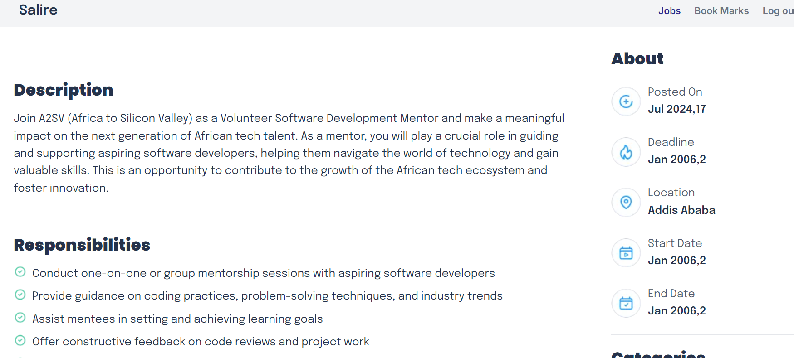

# Salire


## Overview

**Salire** is a modern job listing platform designed to help job seekers find opportunities that align with their skills and career aspirations. The platform offers a user-friendly interface, comprehensive search functionality, and a bookmark feature to save jobs for future reference.

## Features

- **Authentication:** Secure login and registration for users to access personalized job listings and save their bookmarks.
  
- **Job Listing:** Browse through a wide variety of job opportunities .

- **Detailed Job Descriptions:** View detailed information about job roles, responsibilities, qualifications, and company details.

- **Job Bookmarking and Unbookmarking:** Save your favorite jobs to review later and easily unbookmark them if they are no longer of interest.

- **Responsive Design:** Optimized for both desktop and mobile devices.

## Technologies Used

- **React**: For building the user interface
- **Next.js**: For server-side rendering and routing
- **TypeScript**: For type-safe JavaScript
- **Tailwind CSS**: For styling the application

## Testing

- **Jest**: For unit testing the components and logic.
- **Cypress**: For end-to-end (E2E) testing to ensure the application behaves as expected from a user's perspective.

## Getting Started

### Prerequisites

Before you begin, ensure you have the following installed:

- **Node.js** (v14.x or higher)
- **npm** (v6.x or higher)
- **Git**

### Installation

1. Clone the repository:
    ```bash
    git clone https://github.com/Emnet-tes/A2SV---Web-Learning-Tasks.git```
2. Navigate to the project directory:
    ```bash
    cd Salire
    ```
3. Install the necessary packages:
    ```bash 
    npm install 
    ```

### Running the Application
1. Start the development server:
    ```bash 
    npm start
    ```
2. Open your browser and navigate to `http://localhost:3000` to see the application in action.


### Running test
### Unit Tests with Jest

To run unit tests using Jest:

```bash
npm test
```
### End-to-End Tests with Cypress

1. start tha application
```bash
npm start 
```
2. In a new terminal, run the Cypress test runner:
```bash
npm run cypress:open
```
## Building for Production
To build the application for production, use the following command:

```bash
npm run build
```
This will create an optimized production build of the application.

## Starting the Production Server
After building the application, you can start the production server with:

```bash
Copy code
npm start

```

## Screen shots

-  User Authentication: Users are required to sign up or sign in to access job listings. 
    

    

    

    
    Authenticated users are redirected to the Home page, while unauthenticated users are directed to the Sign-Up page
-loading page
     
- display job postings 
    
- bookmark jobs
    
    
- unbookmark jobs
    
-bookmarks page that shows all the bookmarked job
    
- View detailed information about each job
    
    
- Responsive design for optimal viewing on different devices

