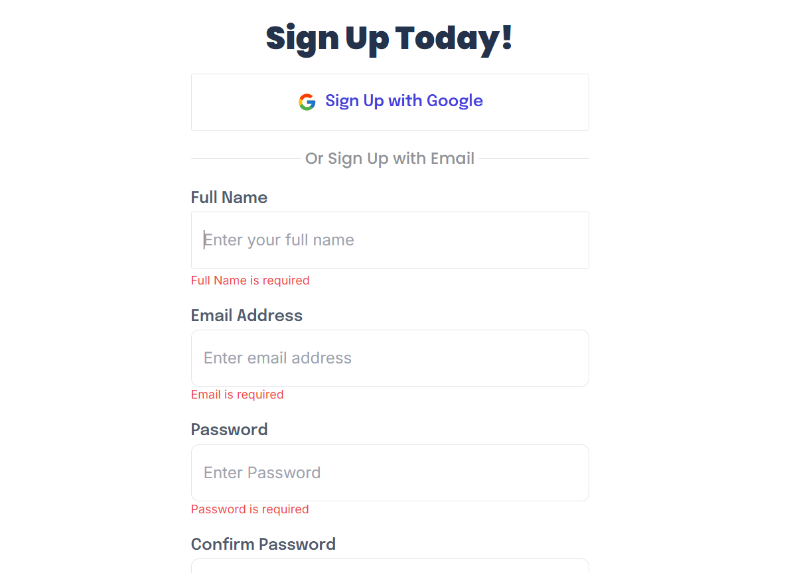
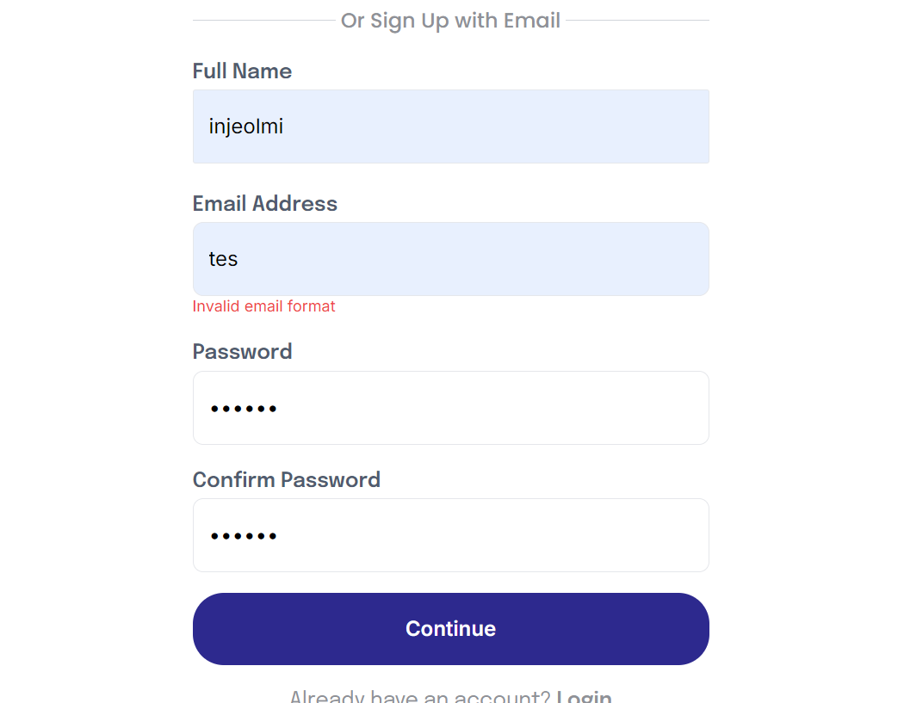
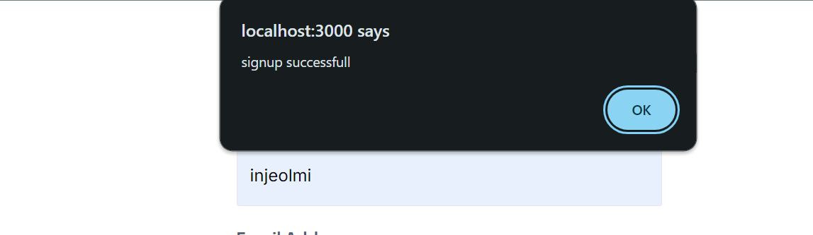
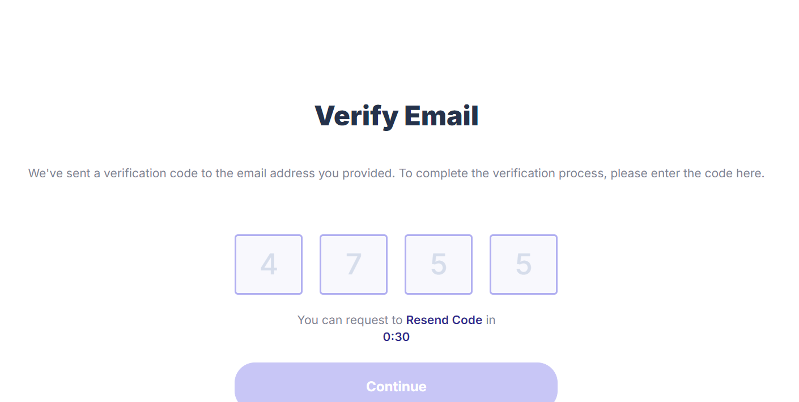
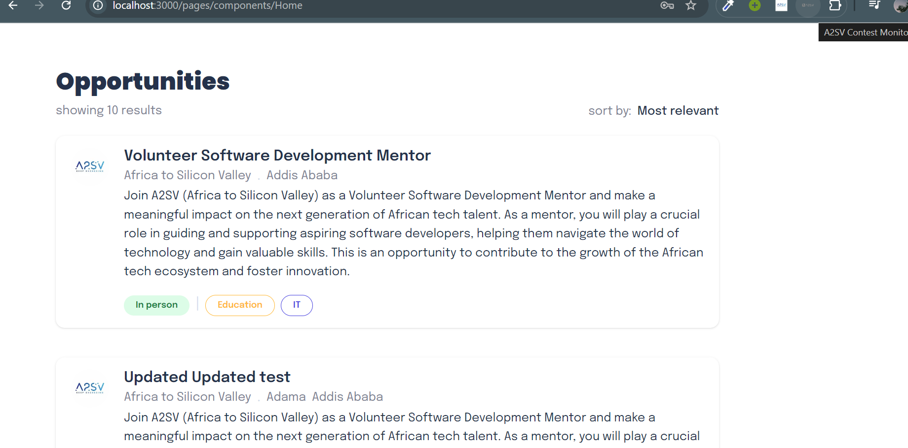
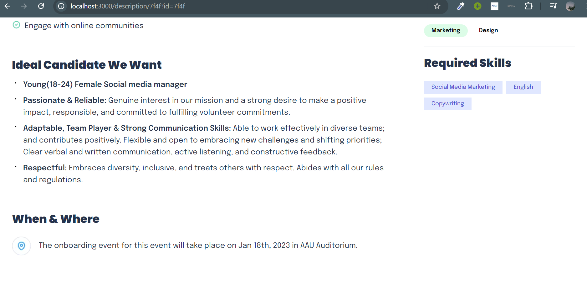

# Job Listing App

## Overview

The Job Listing App is a web application designed to display job postings and their details. It fetches job postings from an API and allows users to view information such as job descriptions, responsibilities, required skills, and more. The application is built using React, Next.js, and TypeScript for a robust and type-safe development experience.

## Features

-  User Authentication: Users are required to sign up or sign in to access job listings. 
    

    

    

    
    Authenticated users are redirected to the Home page, while unauthenticated users are directed to the Sign-Up page

- Fetch and display job postings from an json data
    
- View detailed information about each job
    
- Categories and required skills are visually highlighted
    
- Responsive design for optimal viewing on different devices

## Technologies Used

- **React**: For building the user interface
- **Next.js**: For server-side rendering and routing
- **TypeScript**: For type-safe JavaScript
- **Tailwind CSS**: For styling the application

## Getting Started

### Prerequisites

- Node.js (v14 or higher)
- npm or yarn

### Installation

1. **Clone the repository:**

    ```bash
    git clone https://github.com/Emnet-tes/A2SV---Web-Learning-Tasks.git
    cd job listing app
    cd job-listing-app
    ```

2. **Install dependencies:**

    ```bash
    npm install
    # or
    yarn install
    ```


### Running the Application

To run the application locally, use the following command:

```bash
npm run dev
# or
yarn dev
```
Open your browser and navigate to http://localhost:3000 to see the application in action.

## Building for Production
To build the application for production, use the following command:

```bash
Copy code
npm run build
# or
yarn build
```
This will create an optimized production build of the application.

## Starting the Production Server
After building the application, you can start the production server with:

```bash
Copy code
npm start
# or
yarn start
```

## Components
AboutCard: Displays information about the job posting.
CategoriesCard: Displays categories related to the job posting.
RequiredSkillsCard: Displays the required skills for the job posting.
ResponsibilitiesCard: Displays the responsibilities associated with the job posting.
IdealCandidate: Displays the ideal candidate profile for the job posting.
WhenAndWhere: Displays the timing and location details of the job posting.###