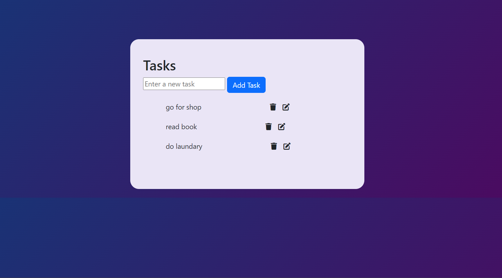

# To-Do App

A simple and elegant To-Do application built with **HTML**, **CSS**, and **JavaScript**. This app allows users to create, edit, and delete tasks efficiently. It provides a clean interface to manage daily tasks, making it an ideal tool for organizing your workload.

## Features

- **Add Tasks**: Quickly add new tasks with a simple input field.

- **Edit Tasks**: Easily edit existing tasks by clicking the edit icon.

- **Delete Tasks**: Remove tasks from your list with a simple click on the delete icon.

- **Responsive Design**: The app is designed to be responsive and user-friendly across different devices.

## Technologies Used

- **HTML**: For the structure of the application.
- **CSS**: For styling the application and creating an appealing layout.
- **JavaScript**: For adding dynamic functionality, allowing users to manage their tasks.

Installation Guide
Prerequisites
For the basic setup, no prerequisites are needed besides a modern web browser.

Steps
Clone the Repository:
Open your terminal and run the following command to clone the repository:

sh
Copy code
git clone  https://github.com/Emnet-tes/A2SV---Web-Learning-Tasks/tree/main/todo%20app%20using%20Js
cd todo-app
Open the Application:
Navigate to the project directory and open index.html in your web browser:

sh
Copy code
open index.html
Alternatively, you can just double-click index.html to open it in your default web browser.