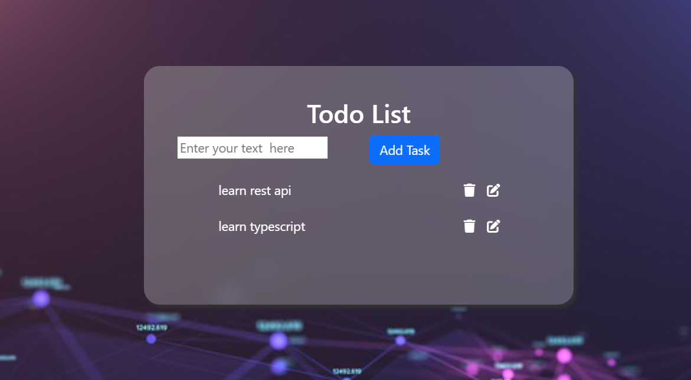

# To-Do App

A simple and elegant To-Do application built with HTML, CSS, JavaScript, and TypeScript. This app allows users to create, edit, and delete tasks efficiently. It provides a clean interface to manage daily tasks, making it an ideal tool for organizing your workload.

## Features

- **Add Tasks**: Quickly add new tasks with a simple input field.
  
- **Edit Tasks**: Easily edit existing tasks by clicking the edit icon.
  
- **Delete Tasks**: Remove tasks from your list with a simple click on the delete icon.
  

## Technologies Used

- **HTML**: For the structure of the application.
- **CSS**: For styling the application and creating an appealing layout.
- **JavaScript**: For adding dynamic functionality, allowing users to manage their tasks.
- **TypeScript**: For type safety and enhanced development experience.

## Installation Guide

### Prerequisites

Before you begin, ensure you have the following installed:

- [Node.js](https://nodejs.org/) (which includes npm)

### Steps

1. **Clone the Repository**:

    ```sh
    git clone https://github.com/Emnet-tes/A2SV---Web-Learning-Tasks/tree/main/todo%20app%20using%20Ts
    cd todo-app
    ```

2. **Install Dependencies**:

    ```sh
    npm install
    ```

3. **Start the Development Server**:

    ```sh
    npm start
    ```

4. **Build for Production**:

    ```sh
    npm run build
    ```

