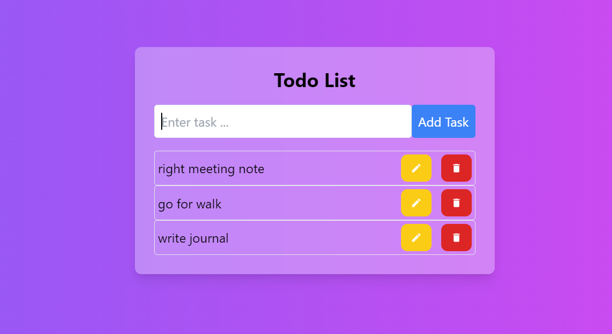
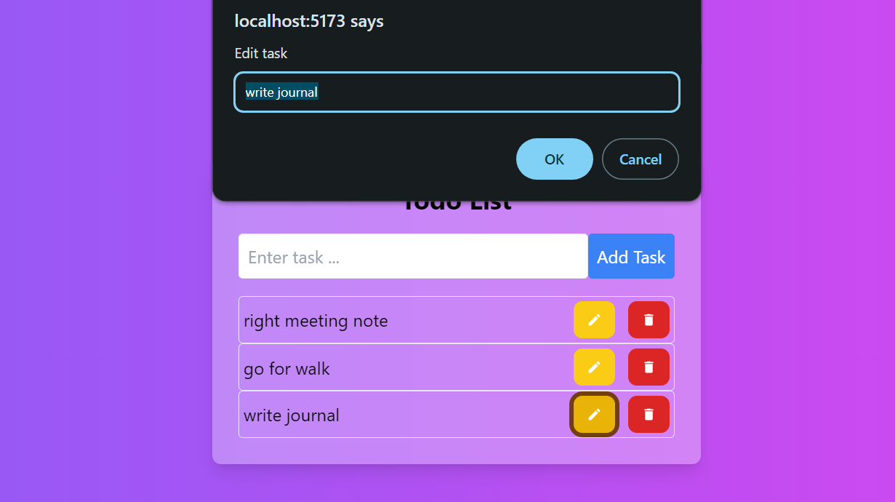
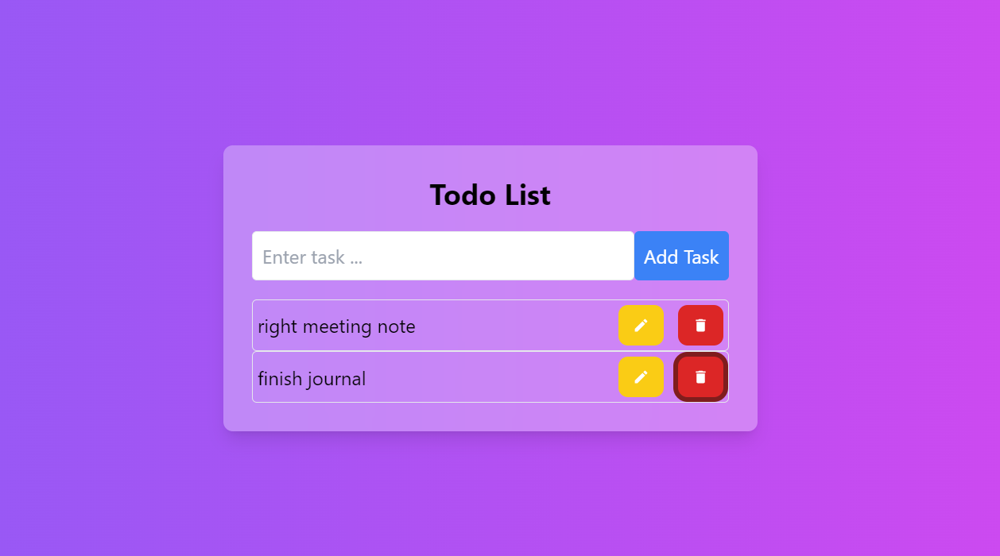

# Todo App

A simple and intuitive Todo application built using React and TypeScript, styled with Tailwind CSS. This app allows users to add, edit, and delete tasks.

## Features
- Add new tasks.
  
- Edit existing tasks.
  
- Delete tasks.
  
- Responsive and user-friendly interface.
- Uses Tailwind CSS for styling.

## Getting Started

These instructions will help you set up and run the project on your local machine for development and testing purposes.

### Prerequisites

Ensure you have the following software installed:

- [Node.js](https://nodejs.org/) (v14 or higher)
- [npm](https://www.npmjs.com/) or [Yarn](https://yarnpkg.com/)

### Installation

1. Clone the repository:

    ```bash
    git clone https://github.com/Emnet-tes/A2SV---Web-Learning-Tasks.git
    cd todo\ app\ using\ react
    cd todo-app
    ```

2. Install the dependencies:

    ```bash
    npm install
    # or
    yarn install
    ```

### Running the Application

To start the d
